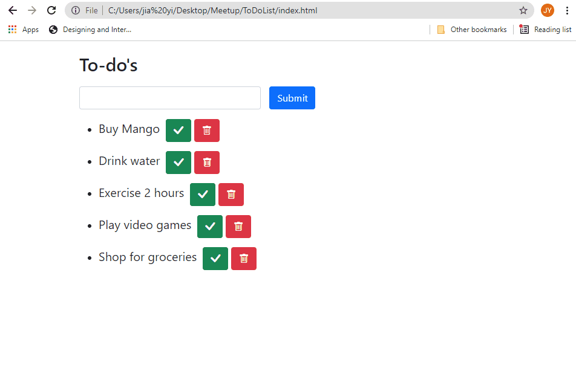

# ToDoList_WebApp_Beginner
This beginner project shows us how to make styling with CSS, basics of HTML components and also using Javascript to make the buttons interactive. Learnt this example from one of the free seminars.

Demo is as below:
